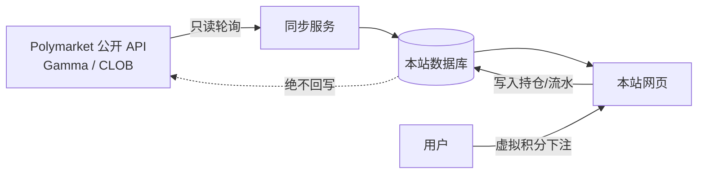

# 00 · 产品概述与愿景

← [文档索引](./README.md) · 下一篇 → [01 架构](./01-architecture.md)

---

## 1. 一句话定义

**ClonePolyMarket** 是一个娱乐性质的预测市场模拟盘：它镜像 [Polymarket](https://polymarket.com) 的真实市场与赔率，让用户用**虚拟积分**体验「下注 → 持仓 → 结算 → 排行」的完整博弈闭环，全程不涉及任何真实资金。

## 2. 为什么做这个

| 动机 | 说明 |
|---|---|
| **零金融风险的博弈爽感** | 保留预测市场「看对趋势赚积分」的核心乐趣，去掉真金白银与合规负担。 |
| **搭便车真实数据** | 市场问题、实时赔率、结算结果全部来自 Polymarket 公开 API，无需自建做市与预言机。 |
| **社交与竞争** | 全站排行榜让用户比拼眼光，形成留存与传播动机。 |
| **技术演示** | 展示「只读镜像第三方数据 + 虚拟经济系统 + 实时排行」的完整工程实现。 |

## 3. 核心机制（与真实 Polymarket 的关系）

**关键约束（贯穿全部设计）：**

1. **只读镜像**：本站只消费 Polymarket 公开数据，**永不下真实单、永不回写、不影响其真实赔率**。
2. **价格外生**：市场价格由 Polymarket 决定；本站用户的下注**不改变**任何市场的赔率。好处是无滑点、实现简单；代价是本站「市场」不因本站用户行为波动——娱乐场景完全可接受。
3. **结算搭便车**：市场结果直接读 Polymarket 的结算数据（`closed: true` 且 `outcomePrices` 变为 `["1","0"]` 或 `["0","1"]`），本站不做任何判定。

## 4. 目标用户

- **主要**：对时事、加密、体育、政治感兴趣，想「无风险预测」的娱乐玩家。
- **次要**：想直观理解预测市场概率机制的学习者。
- **非目标**：真实交易者、需要提现或真实收益的用户。

## 5. 核心用户故事

| 编号 | 作为… | 我想… | 以便… |
|---|---|---|---|
| US-1 | 新用户 | 用昵称+密码免注册门槛开号，立即获得 10,000 积分 | 无门槛开始体验 |
| US-2 | 玩家 | 浏览按热度/分类排列的市场列表 | 找到感兴趣的问题 |
| US-3 | 玩家 | 查看单个市场的当前赔率与历史走势图 | 判断该不该下注 |
| US-4 | 玩家 | 用积分按当前赔率买入 Yes/No 份额 | 押注我看好的结果 |
| US-5 | 玩家 | 查看我的持仓、成本、当前浮盈浮亏 | 跟踪我的表现 |
| US-6 | 玩家 | 在市场结算前按当前赔率卖出持仓 | 提前止盈/止损 |
| US-7 | 玩家 | 市场结算后自动收到积分赔付 | 兑现我的正确判断 |
| US-8 | 玩家 | 在全站排行榜看到我的排名与他人对比 | 获得竞争与成就感 |
| US-9 | 玩家 | 查看我的历史交易流水 | 复盘我的决策 |

## 6. 范围

### 6.1 MVP（首版必做）

- 用户注册/登录（**昵称 + 密码**，昵称唯一去重；初始 10,000 积分，无需邮箱）。
- 市场列表页（从 Polymarket 同步的活跃市场）。
- 市场详情页（当前赔率 + 历史走势图 + 下注面板）。
- 买入 Yes/No 份额（虚拟积分，锁定成交价，**无手续费**）。
- 卖出持仓（按当前镜像价）。
- 自动结算与赔付（跟随 Polymarket 结算；50-50/作废市场**全额退回成本**）。
- 个人持仓页 + 交易流水。
- 全站排行榜（**按积分净值单一口径**排序）。
- 后台同步服务（定时轮询 Polymarket）。

### 6.2 Post-MVP（后续迭代）

- 市场搜索与高级筛选、分类导航。
- **多结果市场**（多选一，如大选/冠军）支持。
- 用户主页（他人可查看的公开战绩）。
- 关注/好友、私人小组排行榜。
- 成就徽章、连胜等游戏化元素。
- 实时推送（WebSocket）替代轮询刷新。

### 6.3 明确不做（Out of Scope）

- ❌ 任何真实资金充值、提现、法币兑换。
- ❌ 自建做市 / 订单撮合（价格全部镜像 Polymarket）。
- ❌ 自建预言机 / 人工判定市场结果（结算全部跟随 Polymarket）。
- ❌ 向 Polymarket 或区块链回写任何数据。
- ❌ 移动原生 App（首版为响应式 Web）。
- ❌ 任何积分补给：签到、破产重置、充值。积分只在注册时发放 10,000，用完即止（用户可另注册新号）。
- ❌ 交易手续费 / 抽水。
- ❌ 多结果（非二元）市场（MVP 仅镜像 Yes/No 二元市场，多结果作 Post-MVP）。

## 7. 成功标准（可验证）

| 维度 | 标准 |
|---|---|
| **数据保真** | 本站展示的市场赔率与 Polymarket 官方页面偏差 ≤ 一个同步周期（默认 ≤ 30s）。 |
| **积分守恒** | 任意时刻：`Σ(用户余额) + Σ(未结算持仓锁定值) = 总发行积分`，无凭空增减。 |
| **结算正确性** | 市场在 Polymarket 结算后，本站在下一同步周期内完成赔付：获胜方每份赔付 1 积分、失败方归零；50-50/作废市场全额退回买入成本。 |
| **性能** | 市场列表页 LCP < 2.5s（4G）；下注操作端到端 < 500ms 反馈。 |
| **可用性** | Polymarket API 短暂不可用时，本站仍能展示上次缓存的赔率并禁用下注，不崩溃。 |

## 8. 关键假设

> 以下假设若被推翻，会显著影响架构，需及早确认。详见 [08-open-questions](./08-roadmap-and-open-questions.md)。

1. Polymarket Gamma / CLOB 公开 API 持续可用、无需鉴权、允许合理频率的只读访问。（已实测可用，2026-07）
2. 采用**镜像价格**模型（用户下注不影响赔率），而非自建 LMSR 做市。见 [ADR-002](./decisions/ADR-002-mirror-pricing.md)。
3. **仅支持二元市场**：同步时过滤 `outcomes.length != 2`；数据模型预留多结果扩展。见 [ADR-005](./decisions/ADR-005-product-rules.md)。
4. **积分只发不补**：注册发 10,000，无任何补给；用完即止。排行榜按积分净值单一口径。见 [ADR-005](./decisions/ADR-005-product-rules.md)。
5. **50-50/作废市场全额退回成本**（VOID 处理）；正常市场按获胜方赔 1、失败方归零。见 [05 §5.3](./05-trading-and-settlement.md#53-void-特殊结算全额退回)。
6. 首版为单体 Next.js 应用 + 托管 Postgres，不引入微服务。见 [ADR-001](./decisions/ADR-001-tech-stack.md)。

## 9. 术语表

| 术语 | 含义 |
|---|---|
| **Market（市场）** | 一个可下注的二元问题，如「Rihanna 会在 GTA VI 之前发新专辑吗？」，有 Yes/No 两个结果。 |
| **Event（事件）** | Polymarket 中若干相关 market 的分组，如「GTA VI 之前会发生什么？」。 |
| **Outcome（结果）** | 市场的一个可能答案，二元市场即 `Yes` / `No`。 |
| **Share（份额）** | 用户持有的某一结果的仓位单位；结算时获胜方每份赔付 1 积分。 |
| **Price / Odds（赔率）** | 某结果的当前价格，范围 $[0,1]$，可直接读作隐含概率。 |
| **Position（持仓）** | 用户在某市场某结果上持有的份额及其平均成本。 |
| **Net Worth（净值）** | 用户余额 + 所有未结算持仓的当前市值。 |
| **Settlement（结算）** | 市场在 Polymarket 关闭并确定结果后，本站对持仓进行赔付/清零。 |

---

← [文档索引](./README.md) · 下一篇 → [01 架构](./01-architecture.md)
