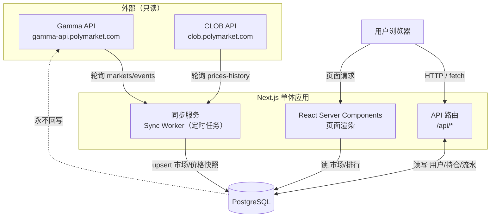
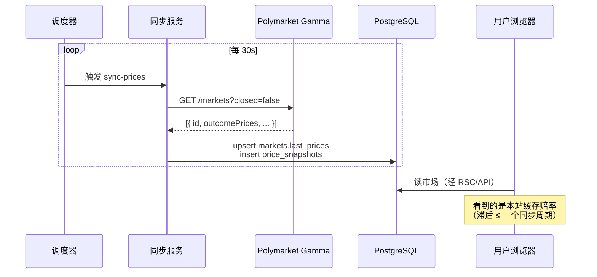
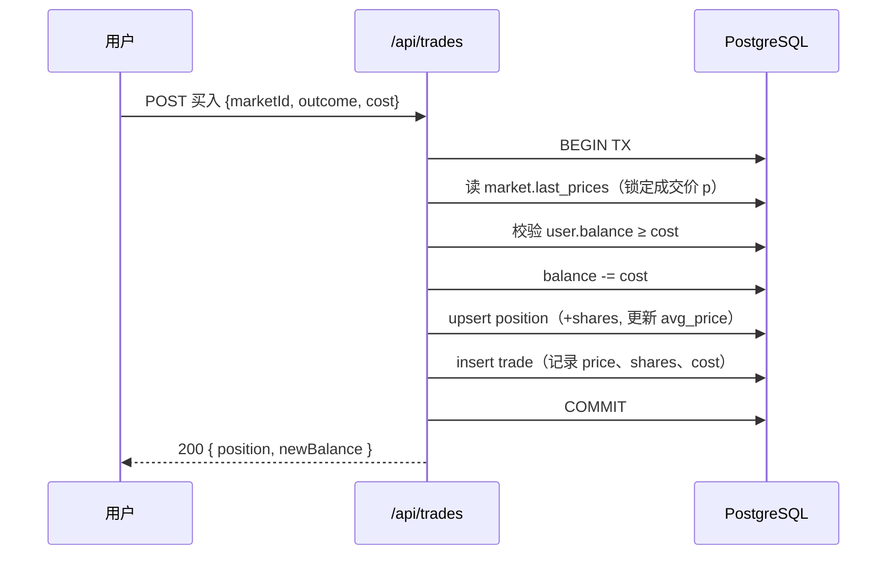
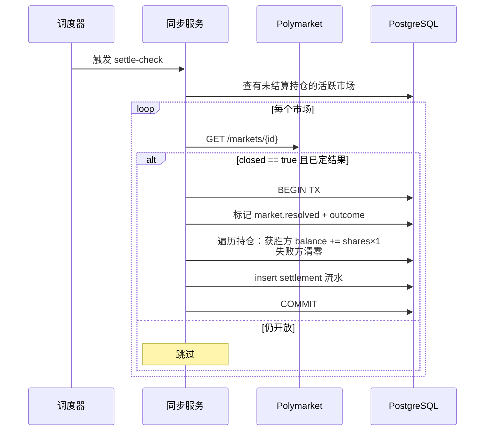

# 01 · 系统架构

← [00 概述](./00-overview.md) · [文档索引](./README.md) · 下一篇 → [02 数据模型](./02-data-model.md)

---

## 1. 架构总览

单体 Next.js 应用（App Router）承担前端渲染、后端 API 与后台同步任务；PostgreSQL 为唯一持久层；所有 Polymarket 数据经由一个**集中式同步服务**只读拉取后落库，用户永远只读本站数据库。



## 2. 组件职责

### 2.1 同步服务（Sync Worker）

**唯一**与 Polymarket 通信的组件。集中轮询避免每个用户请求都打外部 API（保护自身、尊重对方限流）。

| 任务 | 频率（默认，可配） | 数据源 | 落库目标 |
|---|---|---|---|
| **活跃市场目录同步** | 5 min | `GET /markets?active=true&closed=false` | `markets` 表（upsert 元数据） |
| **实时赔率同步** | 30 s | `GET /markets?closed=false`（批量读 `outcomePrices`） | `markets.last_prices` + `price_snapshots` |
| **结算检测** | 60 s | `GET /markets/{id}`（对本站有未结算持仓的市场） | 触发结算流程（见 [05](./05-trading-and-settlement.md)） |
| **历史走势缓存** | 按需 + 15 min | `GET /prices-history?market={clobTokenId}` | `price_history` 缓存表 |

实现选项（见 [ADR-004](./decisions/ADR-004-sync-scheduling.md)）：
- **首选**：外部调度器（Vercel Cron / GitHub Actions / 云函数定时）调用受保护的 `/api/cron/sync-*` 端点。Serverless 友好。
- **备选**：独立 Node 常驻进程 `setInterval` 轮询（自托管场景）。

### 2.2 API 路由（`/api/*`）

处理用户读写：注册登录、下注、卖出、查询持仓/流水/排行。所有写操作在**数据库事务**内完成以保证[积分守恒](./02-data-model.md#4-核心不变量)。详见 [04 API 设计](./04-api-design.md)。

### 2.3 页面渲染（RSC + Client Components）

- **Server Components**：市场列表、市场详情、排行榜——直接读 DB，SSR 首屏。
- **Client Components**：下注面板、实时净值、走势图——交互与轮询刷新。

### 2.4 数据库（PostgreSQL）

唯一事实来源（对用户而言）。承载用户、市场镜像、持仓、流水、价格快照。选型理由见 [ADR-001](./decisions/ADR-001-tech-stack.md)。

## 3. 关键数据流

### 3.1 赔率镜像流



### 3.2 下注流（写事务）



> **不变量守护**：余额扣减、持仓增加、流水记录必须在**同一事务**内原子完成。任何一步失败则整体回滚，杜绝积分凭空产生/消失。详见 [02 §4](./02-data-model.md#4-核心不变量)。

### 3.3 结算流



## 4. 分层与目录结构

```
clone-polymarket/
├── docs/                      # 本技术方案
├── prisma/
│   └── schema.prisma          # 数据库模型（见 02）
├── src/
│   ├── app/                   # Next.js App Router
│   │   ├── (marketing)/       # 落地页、法律声明
│   │   ├── markets/           # 市场列表 + 详情页
│   │   ├── leaderboard/       # 排行榜
│   │   ├── portfolio/         # 个人持仓/流水
│   │   └── api/               # 后端 API 路由
│   │       ├── auth/
│   │       ├── markets/
│   │       ├── trades/
│   │       ├── leaderboard/
│   │       └── cron/          # 受保护的同步端点
│   ├── components/            # UI 组件（见 06）
│   │   ├── ui/                # 基础组件（Button, Card…）
│   │   ├── market/            # 市场卡片、下注面板、走势图
│   │   └── leaderboard/
│   ├── lib/
│   │   ├── polymarket/        # Gamma/CLOB 客户端 + 类型 + 校验
│   │   ├── trading/           # 下注/卖出/估值/结算核心逻辑
│   │   ├── db.ts              # Prisma client 单例
│   │   └── auth.ts            # 会话/鉴权
│   └── types/                 # 共享 TS 类型
├── tests/                     # 单元 + 集成测试
└── e2e/                       # 端到端测试
```

## 5. 技术选型摘要

| 层 | 选型 | 理由（详见 ADR） |
|---|---|---|
| 全栈框架 | Next.js (App Router) + TypeScript | 前后端一体、SSR、Serverless 友好。[ADR-001](./decisions/ADR-001-tech-stack.md) |
| 数据库 | PostgreSQL + Prisma | 事务保证积分守恒、关系模型契合、类型安全。[ADR-001](./decisions/ADR-001-tech-stack.md) |
| 定价模型 | 镜像 Polymarket 赔率 | 无需自建做市，实现简单无滑点。[ADR-002](./decisions/ADR-002-mirror-pricing.md) |
| 样式 | Tailwind CSS | 快速、约束一致的设计系统落地。[ADR-003](./decisions/ADR-003-frontend-stack.md) |
| 同步调度 | 外部 Cron → 受保护端点 | Serverless 部署友好。[ADR-004](./decisions/ADR-004-sync-scheduling.md) |
| 实时刷新 | 轮询（MVP）→ WebSocket（后续） | MVP 够用，避免过早复杂化。 |
| 部署 | Vercel + 托管 Postgres | 零运维起步。 |

## 6. 非功能性关注点

| 关注点 | 处理方式 |
|---|---|
| **外部 API 容错** | 同步服务失败重试 + 指数退避；失败时保留上次快照，前端标记「赔率更新中」并可禁用下注。 |
| **限流友好** | 集中轮询 + 批量拉取，绝不按用户请求转发到 Polymarket。 |
| **一致性** | 所有涉及积分的写操作在 DB 事务内完成，见 [02 §4](./02-data-model.md#4-核心不变量)。 |
| **可观测性** | 同步任务记录成功/失败/延迟；结算记录审计流水。见 [08](./08-roadmap-and-open-questions.md)。 |
| **安全** | 服务端校验所有下注输入；成交价由服务端锁定，不信任前端传入价格。见 [04 §5](./04-api-design.md)。 |

---

← [00 概述](./00-overview.md) · [文档索引](./README.md) · 下一篇 → [02 数据模型](./02-data-model.md)
