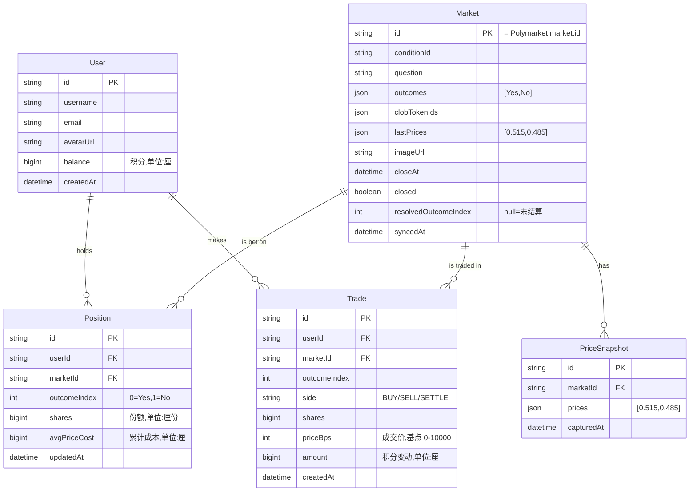

# 02 · 数据模型

← [01 架构](./01-architecture.md) · [文档索引](./README.md) · 下一篇 → [03 Polymarket 集成](./03-polymarket-integration.md)

---

## 1. 实体关系总览

## 2. 数值精度约定（重要）

> **绝不用浮点数存储积分或份额。** 浮点误差会破坏积分守恒不变量。

| 概念 | 存储类型 | 单位 | 示例 |
|---|---|---|---|
| **积分余额 / 金额** | `BigInt` | **厘**（1 积分 = 1000 厘） | 10,000 积分 = `10_000_000` 厘 |
| **份额** | `BigInt` | **厘份**（1 份 = 1000 厘份） | 19.42 份 = `19_420` 厘份 |
| **价格 / 赔率** | `Int` | **基点 bps**（$[0,1]$ → `0..10000`） | 0.515 = `5150` bps |

- 展示层再换算回「积分 / 份 / 概率%」。
- 所有交易/结算算术在整数域进行；除法向下取整并在流水中记录，杜绝舍入泄漏。见 [05 §2](./05-trading-and-settlement.md#2-数值与舍入).

## 3. 表定义（Prisma schema 摘要）

> 完整可执行 schema 在实现阶段落到 `prisma/schema.prisma`；此处为规范性摘要。

### 3.1 `users`

| 字段 | 类型 | 约束 / 默认 | 说明 |
|---|---|---|---|
| `id` | String (cuid) | PK | 用户唯一 ID |
| `username` | String | UNIQUE, NOT NULL | 显示名（排行榜可见） |
| `email` | String | UNIQUE | 登录标识（若用邮箱登录） |
| `passwordHash` | String | | 见 [04 鉴权](./04-api-design.md#2-鉴权) |
| `avatarUrl` | String | nullable | 头像 |
| `balance` | BigInt | DEFAULT `10_000_000` | **可用**积分余额（厘）。初始 10,000 积分。 |
| `createdAt` | DateTime | DEFAULT now() | |

### 3.2 `markets`（Polymarket 镜像）

| 字段 | 类型 | 约束 | 说明 |
|---|---|---|---|
| `id` | String | PK | **= Polymarket `market.id`**（如 `540817`） |
| `conditionId` | String | UNIQUE | 链上 condition id |
| `question` | String | | 市场问题 |
| `description` | String | Text | 结算规则等 |
| `outcomes` | Json | | `["Yes","No"]`（源为字符串，同步时 parse） |
| `clobTokenIds` | Json | | `[yesTokenId, noTokenId]`，用于查历史价 |
| `imageUrl` | String | nullable | 卡片配图 |
| `lastPrices` | Json | | 最新镜像赔率 `["0.515","0.485"]` → 也冗余存 `lastPriceBps: [5150,4850]` |
| `volume` | BigInt | | Polymarket 交易量（用于热度排序） |
| `closeAt` | DateTime | | `endDate` |
| `active` | Boolean | | 是否活跃 |
| `closed` | Boolean | DEFAULT false | Polymarket 是否已关闭 |
| `resolvedOutcomeIndex` | Int | nullable | 结算获胜结果索引；`null`=未结算 |
| `resolvedAt` | DateTime | nullable | 本站完成结算的时间 |
| `syncedAt` | DateTime | | 上次同步时间 |

### 3.3 `positions`（用户持仓）

| 字段 | 类型 | 约束 | 说明 |
|---|---|---|---|
| `id` | String | PK | |
| `userId` | String | FK → users | |
| `marketId` | String | FK → markets | |
| `outcomeIndex` | Int | | `0`=Yes, `1`=No |
| `shares` | BigInt | DEFAULT 0 | 持有份额（厘份），`> 0` |
| `costBasis` | BigInt | DEFAULT 0 | 累计买入成本（厘），用于算平均成本与盈亏 |
| `updatedAt` | DateTime | | |

> **唯一约束**：`(userId, marketId, outcomeIndex)` 唯一——每个用户在每个结果上只有一条聚合持仓。买入更新 `shares` 与 `costBasis`；卖出反向；归零后可保留（`shares=0`）或删除。

### 3.4 `trades`（交易流水，只增不改）

| 字段 | 类型 | 约束 | 说明 |
|---|---|---|---|
| `id` | String | PK | |
| `userId` | String | FK → users | |
| `marketId` | String | FK → markets | |
| `outcomeIndex` | Int | | |
| `side` | Enum | | `BUY` / `SELL` / `SETTLE` |
| `shares` | BigInt | | 本次变动份额 |
| `priceBps` | Int | | 成交价（基点），`SETTLE` 时为 `10000` 或 `0` |
| `amount` | BigInt | | 积分变动（厘）：BUY 为负（花费），SELL/SETTLE 为正（收入） |
| `balanceAfter` | BigInt | | 交易后余额快照（对账用） |
| `createdAt` | DateTime | | |

> **审计追加表**：`trades` 永不更新或删除，是积分守恒的对账依据。

### 3.5 `price_snapshots`（赔率历史）

| 字段 | 类型 | 说明 |
|---|---|---|
| `id` | String PK | |
| `marketId` | String FK | |
| `prices` | Json | 快照时各结果价格 |
| `capturedAt` | DateTime | 抓取时间 |

> 用于本站自绘走势图（也可直接用 Polymarket `prices-history`，见 [03](./03-polymarket-integration.md#4-历史价格)）。可按市场关闭后归档/清理。

## 4. 核心不变量

系统正确性由以下不变量定义，**每次涉及积分的写操作后必须保持**：

### INV-1 · 积分守恒

$$\underbrace{\sum_{u} \text{balance}_u}_{\text{可用余额}} \;+\; \underbrace{\sum_{p} \text{shares}_p \times \text{price}_p}_{\text{持仓当前市值}} \;=\; \text{总净值}$$

- 下注/卖出**不创造也不销毁**积分，只在「余额 ↔ 持仓市值」之间转移。
- 唯一的积分**发行**来源：新用户注册 +10,000（以及后续可选的签到补给）。
- 唯一的积分**再分配**：结算——失败方的持仓价值转移给获胜方（本质上，买入时锁定的成本决定盈亏）。

### INV-2 · 事务原子性

任一下注/卖出/结算操作，对 `balance`、`position`、`trade` 的修改必须在**同一数据库事务**内提交，失败整体回滚。

### INV-3 · 非负约束

- `balance ≥ 0`（买入前校验 `balance ≥ cost`）。
- `position.shares ≥ 0`（卖出前校验持有足够份额）。

### INV-4 · 成交价锁定

`trade.priceBps` 由服务端在事务内从 `market.lastPrices` 读取写入，**绝不采用前端传入的价格**，防止价格操纵。

### INV-5 · 结算幂等

结算流程对同一市场重复执行必须幂等：以 `market.resolvedOutcomeIndex != null` 为已结算标志，二次运行直接跳过，防止重复赔付。

## 5. 索引与查询模式

| 查询 | 索引 |
|---|---|
| 市场列表按热度/时间排序 | `markets(closed, volume DESC)`、`markets(closeAt)` |
| 用户持仓页 | `positions(userId)`、唯一键 `(userId, marketId, outcomeIndex)` |
| 用户流水 | `trades(userId, createdAt DESC)` |
| 排行榜（净值） | 见 [05 §4 估值](./05-trading-and-settlement.md#4-净值与排行榜计算)——净值需实时算，考虑物化视图/缓存 |
| 结算扫描 | `positions(marketId)` join 未结算 markets |
| 走势图 | `price_snapshots(marketId, capturedAt)` |

## 6. 数据生命周期

| 数据 | 策略 |
|---|---|
| 已结算市场 | 保留（用于历史战绩展示）；`closed=true` 从活跃列表过滤。 |
| `price_snapshots` | 市场结算后可归档/降采样，避免无限膨胀。 |
| 用户破产（余额=0 且无持仓） | MVP 保留；后续可选「破产重置」补给（见 [08](./08-roadmap-and-open-questions.md)）。 |

---

← [01 架构](./01-architecture.md) · [文档索引](./README.md) · 下一篇 → [03 Polymarket 集成](./03-polymarket-integration.md)
