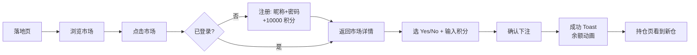
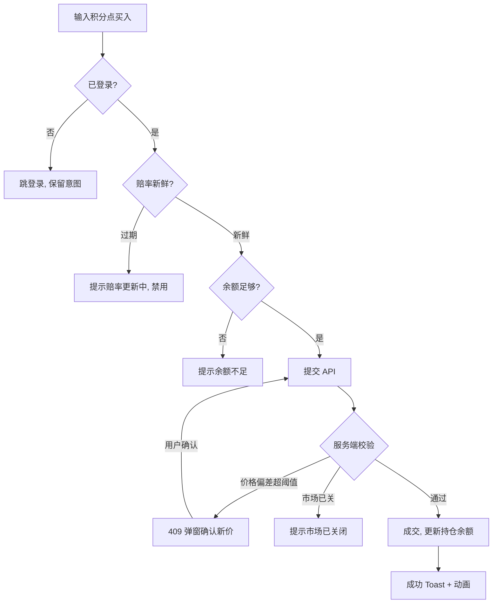

# 07 · 页面与交互流程

← [06 UI/UX 设计系统](./06-ui-ux-design-system.md) · [文档索引](./README.md) · 下一篇 → [08 里程碑与开放问题](./08-roadmap-and-open-questions.md)

---

## 1. 页面清单与路由

| 路由 | 页面 | 渲染 | 鉴权 | MVP |
|---|---|---|---|---|
| `/` | 落地页 / 市场发现 | RSC | 公开 | ✅ |
| `/markets` | 市场列表（筛选/排序/搜索） | RSC + 客户端筛选 | 公开 | ✅ |
| `/markets/[id]` | 市场详情（走势图 + 下注面板） | RSC + 客户端交互 | 浏览公开，下注需登录 | ✅ |
| `/leaderboard` | 排行榜（按积分净值排序） | RSC | 公开 | ✅ |
| `/portfolio` | 我的持仓 + 净值概览 | RSC | 需登录 | ✅ |
| `/portfolio/history` | 我的交易流水 | RSC | 需登录 | ✅ |
| `/u/[username]` | 用户公开战绩主页 | RSC | 公开 | ⬜ Post-MVP |
| `/login` `/register` | 登录 / 注册（昵称+密码） | 客户端 | 公开 | ✅ |
| `/about` | 法律声明 / 玩法说明 | 静态 | 公开 | ✅ |

## 2. 全局框架（App Shell）

```
┌─────────────────────────────────────────────┐
│ TopBar: Logo │ 市场 排行榜 持仓 │ 余额胶囊 头像 │  ← 桌面
├─────────────────────────────────────────────┤
│                  页面内容                      │
└─────────────────────────────────────────────┘
手机：顶栏仅 Logo + 余额胶囊；底部 Tab（市场/排行/持仓/我的）
```

- **BalancePill**（顶栏常驻）：实时余额 + 净值，数字变动动画（见 [06 §6](./06-ui-ux-design-system.md#6-动效)）。
- 未登录时顶栏显示「登录 / 注册」，下注入口引导登录。

## 3. 核心页面详解

### 3.1 市场列表 `/markets`

**布局**：响应式网格（`auto-fit minmax(300px,1fr)`），每张 `MarketCard`：

```
┌────────────────────────────┐
│ [配图]        截止 12d ⏳    │
│ New Rihanna Album           │
│ before GTA VI?              │
│ ┌──────────┬─────────────┐  │
│ │ Yes 52%  │  No 48%      │  │  ← ProbabilityBar 双色
│ └──────────┴─────────────┘  │
│ 成交量 $853K   👥 342 玩家   │
└────────────────────────────┘
```

**交互**：
- 顶部筛选栏：排序（热度/临近截止/最新）、状态（进行中/已结算）、搜索框（Post-MVP）、分类 Tab（Post-MVP）。
- 卡片整体可点 → 详情页。
- 空状态：无匹配市场时友好提示 + 清除筛选按钮。
- 加载：骨架屏（skeleton），非 spinner。

### 3.2 市场详情 `/markets/[id]`

**桌面布局**：左侧走势图 + 描述，右侧下注面板（sticky）。

```
┌───────────────────────────┬──────────────────┐
│ [配图] 问题标题             │  TradePanel       │
│ Yes 52% ↑2%   No 48% ↓2%   │  ┌──────┬──────┐  │
│ ┌───────────────────────┐  │  │ Yes  │  No  │  │ ← 选方向
│ │  PriceChart 走势图     │  │  └──────┴──────┘  │
│ │  [1h][1d][1w][1m][max] │  │  投入: [ 500 ] 积分 │
│ └───────────────────────┘  │  预计: 970.9 份     │
│ 结算规则 / 描述             │  若获胜: +970.9 积分 │
│ 我的持仓（若有）            │  余额: 9,500        │
│                            │  [ 买入 Yes ]       │
└───────────────────────────┴──────────────────┘
```

**手机**：走势图与描述纵向堆叠；下注入口为底部固定「下注」按钮，点击弹出**底部抽屉**（`<dialog>`）承载 TradePanel。

**TradePanel 交互细节**：
- 选 Yes/No → 显示对应当前赔率。
- 输入积分 → **实时**计算并显示：预计份额、若获胜潜在赔付、若失败损失。
- 快捷金额按钮：`+100 / +500 / +1000 / All-in`。
- 校验前置：余额不足时按钮禁用并提示；赔率过期显示 `StaleOddsBadge` 且禁用买入。
- 提交 → 乐观 UI 更新余额（失败回滚）→ 成功 Toast + BalancePill 动画。

### 3.3 排行榜 `/leaderboard`

```
按积分净值排序（单一口径）
┌──────────────────────────────────────────┐
│ #  玩家          净值        今日 ↑↓        │
│ 🥇 alice        18,420      +1,240 ↑      │
│ 🥈 bob          15,900      +320 ↑        │
│ 🥉 carol        14,100      −180 ↓        │
│ …                                          │
│ 87 你 (me)      12,300      +540 ↑ ← 高亮  │
└──────────────────────────────────────────┘
```

- 前三名奖章；数字等宽右对齐（`tabular-nums`）。
- 单一净值口径（积分只发不补，净值即公平基准，决策 Q6）；「今日 ↑↓」为可选的净值日变化，非排序依据。
- 当前用户所在行高亮，若不在当前页则底部/顶部固定「我的排名」条（来自 API `meta.me`）。
- 分页或无限滚动。

### 3.4 我的持仓 `/portfolio`

**顶部概览卡**：净值、可用余额、持仓市值（大字 + 涨跌色）。

**持仓表**（`PositionRow`，行非卡片）：

```
市场                方向   份额     均价   现价   市值    盈亏
Rihanna Album...    Yes    970.9   0.515  0.52   505    +5.1 ↑
Kraken IPO...       No     500.0   0.775  ─      结算中  待定
```

- 待结算市场标「结算中」；已结算的移至「历史」或折叠区。
- 每行可点 → 对应市场详情，可快速卖出。

### 3.5 交易流水 `/portfolio/history`

时间倒序表：时间、市场、类型（买/卖/结算）、方向、份额、成交价、积分变动、交易后余额。用于复盘对账（对应 `trades` 表，[02 §3.4](./02-data-model.md#34-trades交易流水只增不改)）。

## 4. 关键交互流程

### 4.1 首次使用（注册 → 首单）



**新手引导**（onboarding，首单前）：一句话说明「用虚拟积分预测，看对结算赚积分，冲排行榜」，配 Yes/No 概率含义微提示。非强制、可跳过。

### 4.2 下注流程（含异常分支）



### 4.3 结算通知流程

用户不在线时结算 → 下次登录在「持仓/流水」看到结算结果 + 顶部汇总通知（如「你有 2 个市场已结算，净赚 +1,240 积分」）。在线时若正看相关页面 → `SettleToast` 实时提示（获胜彩带 / 失败低调）。

## 5. 状态设计（每页必备）

> 加载、空、错误、边界态不是可选项，每个页面都必须设计完整。

| 状态 | 处理 |
|---|---|
| **加载** | 骨架屏（列表卡片/表格行），非全屏 spinner |
| **空** | 市场无结果 / 无持仓 / 排行榜空——插画 + 引导下一步 |
| **错误** | API 失败：可重试的错误卡，不白屏 |
| **赔率过期** | `StaleOddsBadge` + 禁用下注，保留展示旧价 |
| **市场已结算** | 卡片/详情标「已结算 + 结果」，下注区替换为结果说明 |
| **未登录** | 浏览不受限；下注/持仓引导登录，保留操作意图跳回 |
| **破产**（余额 0 且无持仓） | 提示积分已用完、无法买入；**无补给/重置**，引导「用当前号继续观战」或另注册新号 |

## 6. UX 文案原则

- **诚实**：全站不暗示真实收益；关键处标注「虚拟积分 · 娱乐模拟」。
- **具体错误**：不说「出错了」，说「余额不足，还差 200 积分」。
- **概率即语言**：用「52% 可能」而非裸露的 `0.52`；盈亏用「+970 积分」带符号与色彩。
- 详见交互中的错误态措辞（对应 [04 §1.2 错误码](./04-api-design.md#12-统一错误格式)）。

---

← [06 UI/UX 设计系统](./06-ui-ux-design-system.md) · [文档索引](./README.md) · 下一篇 → [08 里程碑与开放问题](./08-roadmap-and-open-questions.md)
