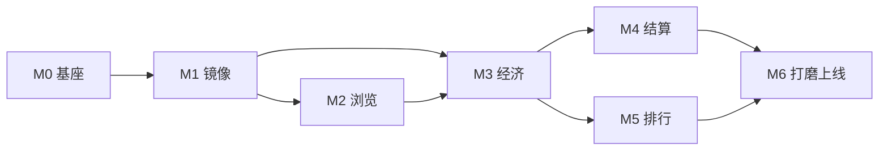

# 08 · 里程碑与开放问题

← [07 页面与交互流程](./07-screens-and-flows.md) · [文档索引](./README.md)

---

## 1. 实现里程碑（建议顺序）

按依赖顺序、垂直切片交付——每个里程碑都是可运行、可验证的增量，而非「先搭全部脚手架」。

### M0 · 项目基座
- Next.js + TypeScript + Tailwind 初始化；Prisma + Postgres 连接。
- 落地 `prisma/schema.prisma`（[02](./02-data-model.md)），跑通 migration。
- 设计 Token 落地 CSS 变量（[06 §2](./06-ui-ux-design-system.md#2-色彩系统oklch)），基础 UI 组件。
- **验证**：`prisma migrate` 成功，空应用可启动，主题色正确。

### M1 · Polymarket 只读镜像
- `lib/polymarket/` 客户端 + zod 校验（[03](./03-polymarket-integration.md)）。
- `sync-markets` + `sync-prices` cron 端点；写入 `markets` / `price_snapshots`。
- **验证**：本地触发同步，DB 出现真实市场与赔率，字段 parse 正确（`outcomes`/`prices`/`clobTokenIds`）。

### M2 · 市场浏览（只读前端）
- `/markets` 列表 + `/markets/[id]` 详情 + 走势图（[07 §3](./07-screens-and-flows.md#3-核心页面详解)）。
- **验证**：页面展示镜像赔率与走势，LCP < 2.5s，响应式无溢出。

### M3 · 用户与虚拟经济
- 注册/登录/会话（[04 §2](./04-api-design.md#2-鉴权)），新用户 +10,000 积分。
- 买入/卖出交易端点 + `lib/trading`（[05](./05-trading-and-settlement.md)），事务 + 行锁。
- 持仓页 + 流水页。
- **验证**：下注后余额/持仓/流水一致；[test 阶段](#3-测试策略)断言积分守恒。

### M4 · 结算
- `settle` cron：检测 Polymarket 结算并赔付（[05 §5](./05-trading-and-settlement.md#5-结算)），幂等。
- 结算通知（[07 §4.3](./07-screens-and-flows.md#43-结算通知流程)）。
- **验证**：用已结算市场（如 Kraken IPO）验证赔付正确、重复运行不重复赔付。

### M5 · 排行榜
- 净值/ROI 计算（[05 §4](./05-trading-and-settlement.md#4-净值与排行榜计算)）+ `/leaderboard`。
- **验证**：排名正确，含「我的排名」，指标切换正常。

### M6 · 打磨与上线
- 全部状态态（加载/空/错误/过期，[07 §5](./07-screens-and-flows.md#5-状态设计每页必备)）、动效、a11y 审查。
- 法律声明页、埋点/监控、部署（Vercel + 托管 Postgres + Cron）。
- **验证**：端到端跑通首单→结算→排行；[成功标准](./00-overview.md#7-成功标准可验证)全达标。

## 2. 边界与规则（Boundaries）

| 类别 | 规则 |
|---|---|
| **Always（总是）** | 涉及积分的写操作在 DB 事务内；提交前跑相关测试；第三方数据经 schema 校验；成交价服务端锁定；金额用整数厘。 |
| **Ask first（先问）** | 改数据库 schema；加新依赖；改结算/守恒/VOID 退回逻辑；从二元扩展到多结果市场；改积分发行规则（当前：只发不补）。 |
| **Never（禁止）** | 向 Polymarket/链上回写；用浮点存积分/份额；信任前端传入价格；提交密钥；暗示真实收益/官方背书；删失败测试。 |

## 3. 测试策略

| 层级 | 框架（拟） | 覆盖 |
|---|---|---|
| 单元 | Vitest | `lib/trading`（买/卖/估值/结算数学、舍入方向）、`lib/polymarket`（parse/校验/结算判定） |
| 集成 | Vitest + 测试 DB | 交易事务、积分守恒不变量、结算幂等、并发行锁 |
| E2E | Playwright | 注册→下注→（模拟）结算→排行；关键状态态 |

**必测不变量**（见 [05 §7](./05-trading-and-settlement.md#7-测试要点)）：积分守恒、舍入不泄漏、结算幂等、并发不透支、边界价不崩、过期赔率拦截。

> 测试由 Tester 专责编写，断言逻辑行为而非当前实现细节。

## 4. 已确定的产品决策

> 以下决策已拍板（2026-07），贯穿全部设计。汇总见 [ADR-005](./decisions/ADR-005-product-rules.md)。

| # | 问题 | 决策 |
|---|---|---|
| **Q1** | 是否支持非二元（多结果）市场？ | **仅二元**。同步时过滤 `outcomes.length != 2`；数据模型预留多结果扩展（`outcomeIndex` 用 `Int`，非 `0\|1` 硬编码），多结果作 Post-MVP。见 [03 §5.2](./03-polymarket-integration.md#52-仅镜像二元市场)、[ADR-005](./decisions/ADR-005-product-rules.md)。 |
| **Q2** | 实时刷新方式？ | **前端轮询**（默认 15–30s 重新拉取）。不引入 WebSocket/SSE。见 [ADR-005](./decisions/ADR-005-product-rules.md)。 |
| **Q3** | 50-50 / 作废等特殊结算？ | **全额退回成本（VOID）**：把用户在该市场的全部买入成本退回余额，视作未发生。见 [05 §5.3](./05-trading-and-settlement.md#53-void-特殊结算全额退回)。 |
| **Q4** | 签到补给 / 破产重置？ | **不补给**。注册发 10,000，无任何补给/重置；用完即止，用户可另注册新号。因此无 ROI 分母问题。 |
| **Q5** | 交易手续费？ | **无手续费**。 |
| **Q6** | 排行榜口径？ | **仅积分净值**单一口径（余额 + 未结算持仓市值）。不做 ROI/已实现多口径。 |
| **Q7** | 身份来源？ | **昵称 + 密码**，昵称唯一去重，无需邮箱。免注册门槛，随便开号。 |
| **Q8** | 展示哪些市场？ | **全量镜像**活跃二元市场，**热度（volume）排序**。 |

## 5. 风险与缓解

| 风险 | 影响 | 缓解 |
|---|---|---|
| Polymarket API 变更/下线 | 数据源中断 | 客户端加版本探测与容错；抽象 `PolymarketClient` 接口便于替换数据源；保留最后快照降级展示。 |
| API 限流/封禁 | 同步失败 | 集中批量拉取、退避、合理频率；监控 429。 |
| 积分守恒 bug | 经济系统失真 | 整数域算术 + 事务 + 不变量测试 + 定期对账（`trades.balanceAfter`）。 |
| 结算判定错误（proposed 阶段过早结算） | 错误赔付 | 严格按 [03 §3](./03-polymarket-integration.md#3-结算信号识别) 判定，`proposed` 不结算；结算幂等。 |
| 合规/商标风险 | 法律问题 | 全站免责声明、不用官方商标、尊重 ToS（[03 §7](./03-polymarket-integration.md#7-合规与归属)）。 |
| 净值计算性能 | 排行榜慢 | 实时聚合→物化视图→增量缓存的升级路径（[05 §4.1](./05-trading-and-settlement.md#41-计算策略性能)）。 |

## 6. 可观测性（上线前）

- 同步任务：成功/失败次数、延迟、拉取市场数、429 计数。
- 结算：每次结算的市场数、赔付总额、跳过（幂等）次数——审计流水。
- 业务：日活、下注笔数、人均净值分布、破产率。
- 告警：同步连续失败、`syncedAt` 全站过期、结算异常。

---

← [07 页面与交互流程](./07-screens-and-flows.md) · [文档索引](./README.md)
